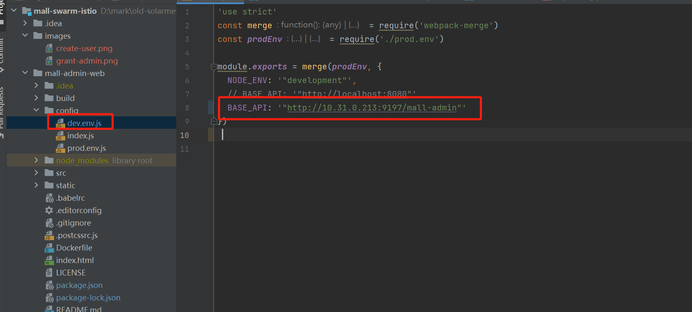

# mall-swarm

## 普通部署

执行：
```shell
kubectl apply -f ./manifests/infra.yaml
kubectl apply -f ./manifests/normal.yaml
```

安装完后：
```shell
kubectl get deploy -n skywalking 
NAME                         READY   UP-TO-DATE   AVAILABLE   AGE
elasticsearch                1/1     1            1           3h4m
mall-admin                   1/1     1            1           3h4m
mall-auth                    1/1     1            1           3h4m
mall-gateway                 1/1     1            1           3h4m
mall-monitor                 1/1     1            1           3h4m
mall-mysql                   1/1     1            1           3h4m
mall-portal                  1/1     1            1           3h4m
mall-search                  1/1     1            1           3h4m
mongodb                      1/1     1            1           3h4m
nacos                        1/1     1            1           3h4m
rabbitmq                     1/1     1            1           3h4m
redis                        1/1     1            1           3h4m

kubectl get svc -n skywalking 
NAME                         TYPE        CLUSTER-IP      EXTERNAL-IP   PORT(S)                           AGE
elasticsearch                ClusterIP   10.233.22.204   <none>        9200/TCP,9300/TCP                 3h7m
mall-admin                   NodePort    10.233.4.47     <none>        8080:23785/TCP                    3h7m
mall-auth                    NodePort    10.233.35.9     <none>        8401:402/TCP                      3h7m
mall-gateway                 NodePort    10.233.58.24    <none>        8201:9197/TCP                     3h7m
mall-monitor                 ClusterIP   10.233.20.55    <none>        8101/TCP                          3h7m
mall-mysql                   NodePort    10.233.26.137   <none>        3306:28561/TCP                    3h7m
mall-portal                  ClusterIP   10.233.41.156   <none>        8085/TCP                          3h7m
mall-search                  NodePort    10.233.4.77     <none>        8081:23745/TCP                    3h7m
mongodb                      ClusterIP   10.233.53.205   <none>        27017/TCP                         3h7m
nacos                        NodePort    10.233.5.43     <none>        8848:17625/TCP                    3h7m
rabbitmq                     ClusterIP   10.233.27.159   <none>        15672/TCP,5672/TCP                3h7m
redis                        ClusterIP   10.233.20.145   <none>        6379/TCP                          3h7m
```

nacos:


1. 导入sql。连接mysql，设置数据库为 mall， 导入 mall-swarm/document/sql 下面的sql文件

2. 配置用户

访问 mall-gateway:/doc.html ，创建用户。


3. 为用户赋予管理员权限

改动ums_admin_permission_relation 表，给这个账号赋予一下超管权限


4. 本地启动mall-admin-web

修改 config/dev.env.js 中的地址为 gateway的实际地址



执行以下命令启动：

```shell
npm install node-sass@latest --sass-binary-site=https://npm.taobao.org/mirrors/node-sass
```

```shell
npm run dev
```

相关issue：https://github.com/macrozheng/mall-admin-web/issues/134 

启动成功后就可以本地调试了。


## skywalking 注入部署

```shell
kubectl apply -f ./manifests/infra.yaml
kubectl apply -f ./manifests/skywalking.yaml
```

其他步骤和上述一致：


